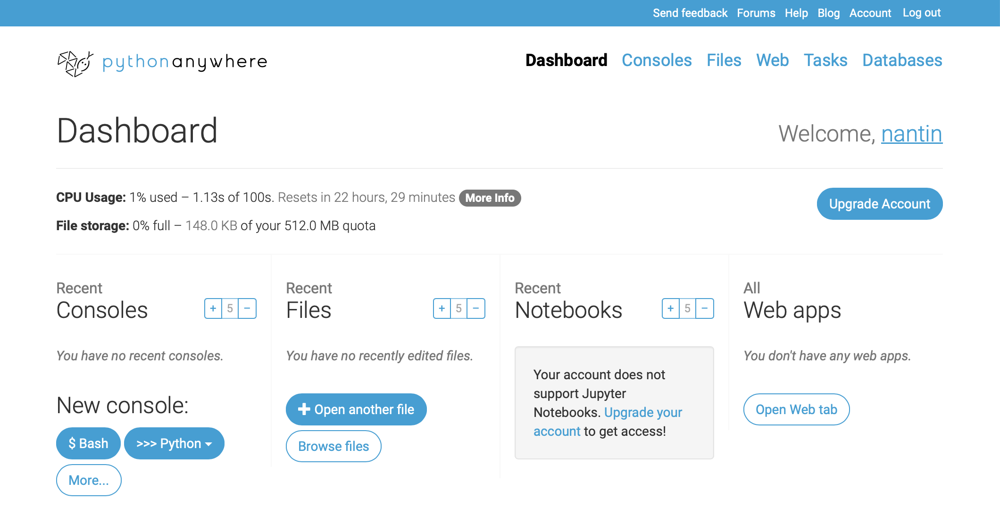
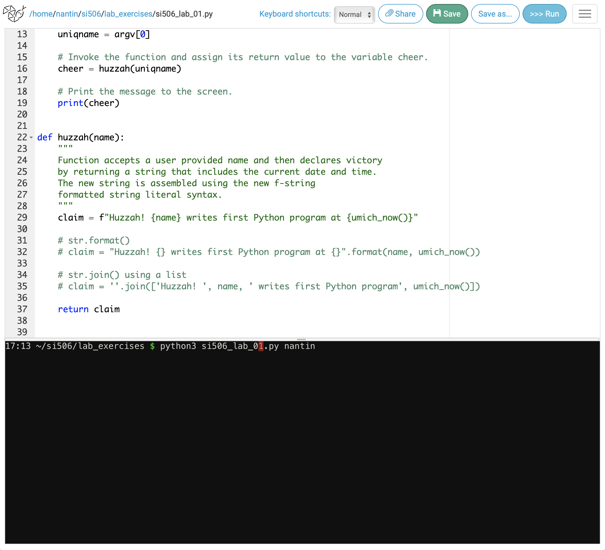
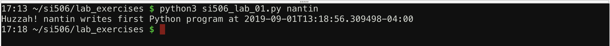

# SI 506
## Lab 01: Python Anywhere Tutorial and Exercise

## Rationale
[Python Anywhere](https://www.pythonanywhere.com/) provides cloud hosting for Python web projects. Python Anywhere also provides a web-based editor, interactive consoles that preserve session state, and storage space for the Python code you write. These are the features that we will leverage during the early weeks of SI 506. Writing Python code on the web will accelerate your engagement with programming. For the next few weeks you can focus on the Python language without having to deal with setting up your laptop to run Python or learning how to use a text/source code editor or interactive development environment (IDE).

## Account creation
Python Anywhere beginner accounts are __free__. To establish an account go to

https://www.pythonanywhere.com/registration/register/beginner/

Provide a username, email address, and password. Read the [Terms and Conditions](https://www.pythonanywhere.com/terms/), [Privacy and Cookies Policy](https://www.pythonanywhere.com/privacy/). Assuming you encounter nothing objectionable, click the checkbox and then click the "Register" button.

:exclamation: You will receive an email from Python Anywhere requesting confirmation of your email address. Follow the instructions (clicked the embedded link).  Once confirmed, your beginner account will be ready for use.

:warning: If you object to the Python Anywhere terms and conditions and/or privacy and cookies policy email <arwhyte@umich.edu> immediately in order to discuss your concerns.

## Dashboard

The Python Anywhere dashboard provides access to consoles (Python, IPython, bash, etc.), files, and web apps (access to Jupyter notebooks require an account upgrade). Of these dashboard items, SI 506 will make limited use of the consoles and file system only.



## Directory creation and navigation

Python Anywhere provides file system management capabilities. Under "Recent Files" click the white "Browse Files" button. Alternatively, you can click the "Files" link located alongside a number of other view links on the upper right hand side of the dashboard.

On the left side of the page below the "Directories" column heading enter a new directory named "si506" into the text box and then click the "New directory" button. The page will refresh, providing a view of the new `home/<username>/si506` directory.

Next, create a new child directory named "lab_exercises". The page will refresh, providing a view of the new `home/<username>/si506/lab_exercises` directory.

You can switch to a parent directory by clicking on the parent directory links located __above__ the "Enter new directory name" text box.

Click the `si506` parent directory link. The page will refresh, providing a view of the `home/<username>/si506` directory. A link to the child `lab_exercises` directory is listed under the "Directories" column.

Next, create a new child directory named "problem_sets". The page will refresh, providing a view of the new `home/<username>/si506/problem_sets` directory.

Click the `si506` parent directory link again. The page will refresh, providing a view of the `home/<username>/si506` directory. Links to sibling `lab_exercises/` and `problem_sets/` directories should now be visible on the page.

:exclamation: If you create a directory in the wrong location, click its trash can icon and delete the directory. Then navigate to the correct parent directory before creating the child directory in the correct location.

:warning: in the `home/<username>` directory are system directories (`.<dir_name>`) and files (`.file_name`) provided by Python Anywhere. Do not edit or delete these items.

## File creation

Navigate to the `home/<username>/si506/lab_exercises` directory.


Below the "Files" column heading enter the new file name `si506_lab_01.py` in the text box and then click the "New file" button. The file name adheres to the all __lowercase__ or all __lower_case_with_underscores__ Python naming convention for modules
(see [PEP 8](https://www.python.org/dev/peps/pep-0008/#id40)). The `.py` extension tags it as a Python file.

Creating a new file will open a text editor. You can then start writing code in the editor.

## Exercise

Today's exercise is designed to get you thinking about what it takes to write a small program that sends a specially formatted message to the screen. Understanding what every line of code attempts to accomplish is not the goal; focus instead on steps required to build this small script and how each function you add to the script is designed to perform a single operation. The exercise also introduces you to Python's use of whitespace indention to denote code blocks, a feature of the language designed for readability and maintainability.

Start by typing into the editor the following code snippets exactly as written and in the prescribed order.

:exclamation: Whitespace, line indents, and parentheses `(...)` and square bracket `[...]` placement matter.

### 1. Add shebang and specify package imports

At the top of the file add the "shebang" line (`#!/usr/bin/env python3`) and three import declarations:

  ```python
  #!/usr/bin/env python3

  import pytz
  import sys
  from datetime import datetime
  ```

### 2. Add function `main(argv)`

Next, insert two blank lines. Then write the `main(argv)` function. This function constitutes the entry point to your program. It starts with the keyword `def` and accepts an argument named `argv`.

The function code block includes a __Docstring__ (surrounded by `""" ... """`) that describes the purpose of the function. Single line comments are prefixed by a hash (`#`) character. Neither type of comment is required to run the program successfully. A few of the comments are actually redundant but included to further your understanding of what is going on in this tiny program.

:exclamation: the function code block __must__ be indented 4 spaces.

```python


def main(argv):
    """
    Entry point to program. Accepts user-supplied value.
    """
    # Assign first element of sys args list to uniqname.
    uniqname = argv[0]

    # Invoke the function and assign its return value to the variable cheer.
    cheer = huzzah(uniqname)

    # Print the message to the screen.
    print(cheer)
```

### 3. Add function `huzzah(name)`

Add a second function named `huzzah(name)`.  Again, insert two blank lines before adding the function. Remember that you must indent the function's code block 4 spaces.

:exclamation: don't forget to prefix the string value assigned to the variable `claim` with the letter `f`.  This formats the string using "f-string", a nifty and compact way of formatting string literals.

:exclamation: Note that f-string includes references to the variable named `name` and calls a function named `umich.now()`.

```python


def huzzah(name):
    """
    Function accepts a user provided name and then declares victory
    by returning a string that includes the current date and time.
    The new string is assembled using the new f-string
    formatted string literal syntax.
    """
    claim = f"Huzzah! {name} writes first Python program at {umich_now()}"

    return claim
```

### 4. Add function `umich_now()`

Add a third function named `umich_now()`. The function `umich_now()` converts Python Anywhere's server time to Coordinated Universal Time (UTC). It then shifts the time to the Eastern time zone (U-M time) and then returns the date time value as a ISO 8601 formatted string. Date/time handling is tricky business.

Again, insert two blank lines before adding the function. Remember that you must indent the function's code block 4 spaces.

```python


def umich_now():
    """
    Convert naive time (i.e., no notion of timezone) to UTC and then
    add offset for eastern time zone. Return as an ISO 8601 formatted string.
    """
    server_now = pytz.utc.localize(datetime.utcnow())
    detroit_now = server_now.astimezone(pytz.timezone("America/Detroit"))

    return detroit_now.isoformat()

```

### 5. Add `__name__` variable check

Finally, add two blank lines and then this last bit of code:

```python


if __name__ == '__main__':
    # Slice on the user-supplied value, ignoring first element in sys.argv (the file path).
    main(sys.argv[1:])

```

When the Python interpreter reads a source file it creates a few special variables like `__name__` prior to attempting to execute the code in the file.  As the Python [documentation](https://docs.python.org/3/library/__main__.html) notes:

> The special value `__main__` is the name of the scope in which the top-level code executes. A module’s `__name__` is set equal to `__main__` when read from standard input, a script, or from an interactive prompt.

 In other words, when you run this script in the console, the Python interpreter will rename to `__main__` and then call the `main()` method to kick off the script operations.

### 6. Save the file

Finish the script by adding a single blank line below the call to `main(sys.argv[1:])`. Then click the green "Save" button.

:exclamation: In Python Anywhere, whenever you run a program the file is automatically
saved. That said, I recommend clicking the green "Save" button at regular intervals as you write your code.

## Bash shell

After saving your changes to `si506_lab_01.py`, click the blue "$ Bash console here" button located at the bottom right and start a Bash (Unix shell) session. The interactive console  opens as a black screen in the lower portion of your browser window.

:warning: click the blue "$ Bash console here" button __not__ the ">>> Run" or ">>> Run this file buttons". If you select the wrong console follow the directions below to close it.  Then click on the parent `lab_exercises/` directory link to return to the file list. Click either the `si506_lab_01.py` filename link or the edit file icon (2nd icon in list) to restart the code editor.

At the `$` prompt type:

python3 si506_lab_01.py \<uniqname\>

appending your uniqname as the command-line argument.

```cmd
~/si506/lab_exercises $ python3 si506_lab_01.py arwhyte

```



Then tap the `[return]` key to run your program.

Your code should print the huzzah message to the screen with your uniqname and ISO 8601 formatted date time inserted:



:exclamation: note the server time prefixing the prompt vs the timezone shifted message time.

Congratulations on writing your first Python program, an exercise a bit more complex than the usual introductory `print('Hello World')` exercise. Don't fret if some of the code that you've written was difficult or impossible to comprehend. Over the coming weeks you will increase your understanding of all that you have just written.  

## Upload screenshot to Canvas

Take a screen shot of the console output and upload the image to Canvas.

https://umich.instructure.com/courses/321528/assignments/827020

If you encounter a runtime error, recheck your code, and once fixed, click the green 'Save' button. Then reissue your command at the `$` prompt.

:exclamation: If you can't get your code to run, take a screen shot anyway of the code and the runtime error encountered in the console and upload the image to Canvas. You earn full credit irrespective of any runtime errors you may encounter when attempting this exercise.

## Closing the console

### Bash (Unix shell)

To end a Bash session and close the console, type `exit` at the command prompt.

### Python Interactive console

You can close a Python interactive console session by using a keyboard shortcut or invoking the Python function `quit()`:

* macOS/\*nix: `[CTRL] + D` or `quit()`, then `[return]`.
* Windows: `[CTRL] + Z`, then `[CTRL]` or `quit()` followed by `[enter]`.

## Console limits

:warning: Python Anywhere limits beginner accounts to two consoles. If you attempt to exceed this limit Python Anywhere will present you with a dialog reminding you of the limit and providing instructions on how to kill consoles.
